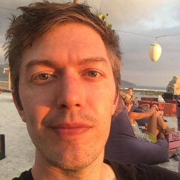

I'm a software developer and independent researcher living in Seattle.

My main interests are using technology to increase individual freedom, AI safety / existential risk, math, economics, philosophy, and the theory of disagreement.

I'm a founder of [Atstake](https://atstake.net), a platform for fairly enforcing two-person contracts using Ethereum.

I'm also working on [using prediction markets to improve institutional decision making](institutionaldecisionmaking.md).

You can find me at:
- [Twitter](https://twitter.com/elliot_olds)
- [Medium](https://medium.com/@elliotolds)
- [Github](https://github.com/elliotolds)
- [Instagram](https://www.instagram.com/symme7ry/)
- elliotolds at Gmail

See my [LinkedIn](https://www.linkedin.com/in/elliotolds/) for more about my background, but don't contact me there.

A while back I created a [wiki](https://bitcoindebates.miraheze.org) about popular debates in the Bitcoin world. It's currently a bit out of date.
