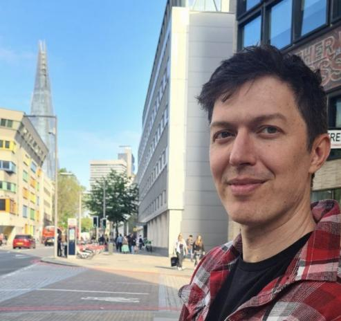

I'm an independent researcher currently working on reducing existential risks from artificial superintelligence. I previously worked on [Impact List](https://impactlist.xyz), a project aimed at ranking the top ~1000 people in the world by impact via donations. Prior to that I founded [Atstake](https://atstake.net), a platform for fairly enforcing two-person contracts using Ethereum. I've also done some preliminary work on [using prediction markets to improve institutional decision making](institutionaldecisionmaking). See my [Projects](projects) page for more details.

My main interests include using technology to increase individual freedom, AI safety / existential risk, math, economics, philosophy, life extension, and the theory of disagreement.

You can find me at:
- [Twitter](https://twitter.com/elliot_olds)
- [Medium](https://medium.com/@elliotolds)
- [Github](https://github.com/elliotolds)
- [Instagram](https://www.instagram.com/symme7ry/)
- elliotolds at Gmail

See my [LinkedIn](https://www.linkedin.com/in/elliotolds/) for more about my background, but don't contact me there.
